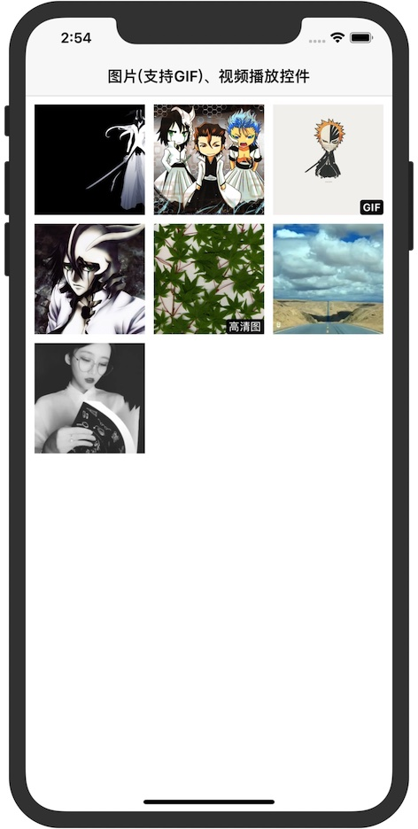
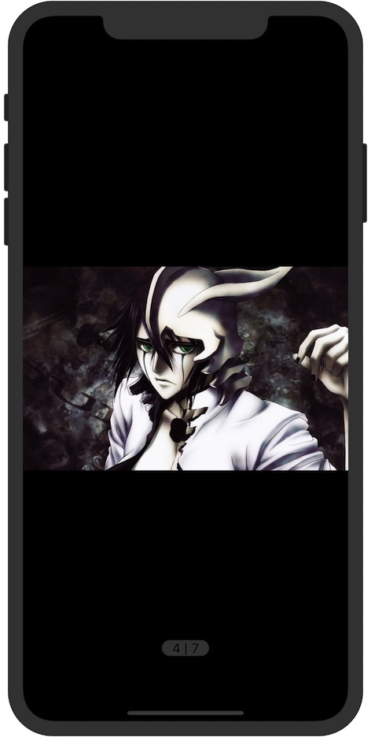
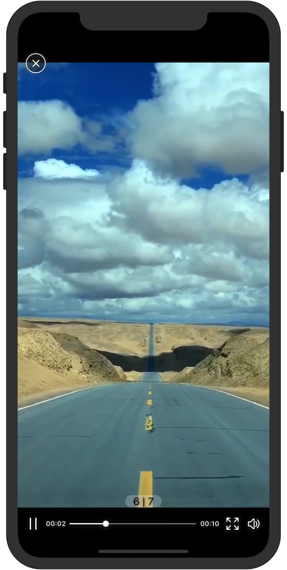
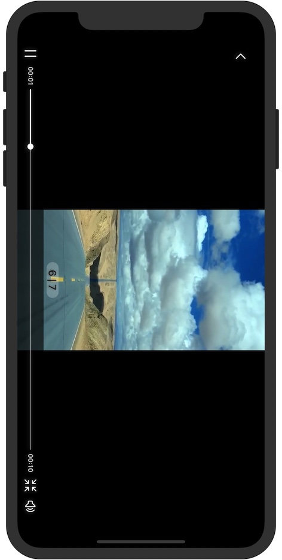

# WHHImageBrowserDemo

#### 主要根据参考[YBImageBrowser](https://github.com/indulgeIn/YBImageBrowser)，更新改变而成的图片、视频播放控件

1、仅支持本地图片、网络图片、网络视频的展示

2、视频仅支持一个方向的旋转，没有重力感应（若需要更多请参考原demo）

3、视频横屏是支持二次返回

4、支持GIF图播放

5、对iPhoneX以上设备的屏幕兼容

### 效果图展示

- 列表效果

- 图片效果

- 视频竖屏

- 视频横屏

